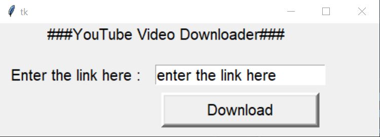
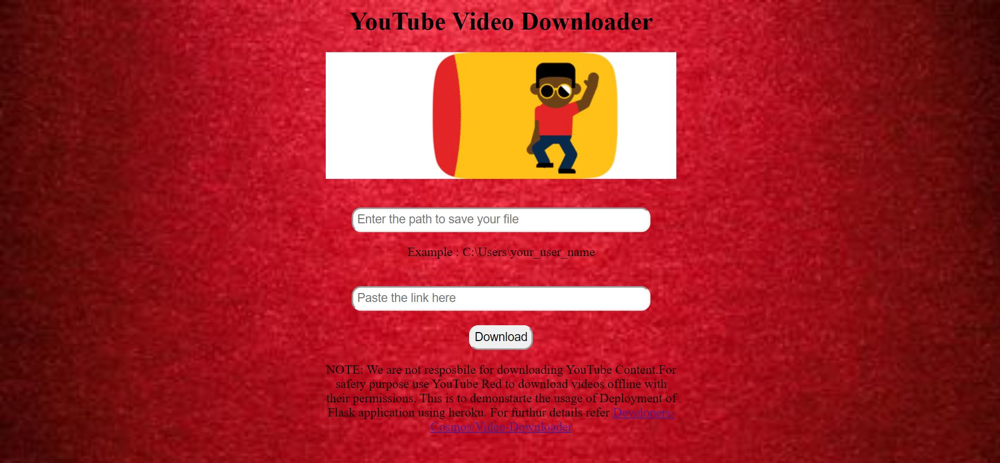

# YouTube Video Downloader

- ## Project Aims

    This Project aims to create a youtube video downloader using youtube-dl, the main intension was to get the idea of creating a Flask Application, Amazon Elasticbean. I have used the basic concepts, you can setup easily with the provided files. You can see the deployed application at [Video-Downloader](videodownloader.kgvbm2zji7.ap-south-1.elasticbeanstalk.com).

- ## SetUp

    1.You should have installed python, if not you can download at [Python](https://www.python.org/
    ).
    
    2.Clone the repository in your directory using the following command 
    ```
    git clone https://github.com/developers-cosmos/Video-Downloader.git
    ```
    or you can simply download the project.

    3.Run the following command for initial setup to install some requirements.
     
     ```python
     pip  install -r requirements
     ```

- ## Usage
1. Run the command to get the GUI (in local host)
    ```python
    python UserInterface.py
    ```
    This file uses tkinter module to provide a GUI for us to make our application look cool!!

    
    

    Trust me its very simple to use tkinter module just go through the documentation [here](https://docs.python.org/2/library/tkinter.html). After succesfully running the above command you can download the youtube videos.

2. The file app.py uses Flask ( is a micro web framework written in Python).
```python
from flask import Flask
app = Flask(__name__)
@app.route('/')
def hello():
    return "Hello World!"

if __name__ == '__main__':
    app.run()
```
The above code gives us Hello World! which runs in our local host. For more details regarding Flask click [here](https://realpython.com/flask-by-example-part-1-project-setup/).
The run() method of flask runs the application, also we can used html,css in our project.

3. If you want to deploy your application we have various method, I used Amazon Elastic Bean which is an orchestration service offered by Amazon Web Services for deploying applications.


I'm attaching a youtube tutorial which will be veru useful if you want your application to be deployed, Click [here](https://www.youtube.com/watch?v=rvxucBBDlPQ&t=351s).

- ## Additonal Resources

I am attaching some links regarding our concept of deploying a Flask Application, if you want to dig deep.
  * [Basics of Python](https://www.w3schools.com/python/)
  * [Flask](https://www.tutorialspoint.com/flask/index.htm)
  * [AWS Elastic Bean](https://aws.amazon.com/elasticbeanstalk/)
  * [HTML Concepts](https://www.w3schools.com/html/html_intro.asp)

 
 ## Thankyou :D
